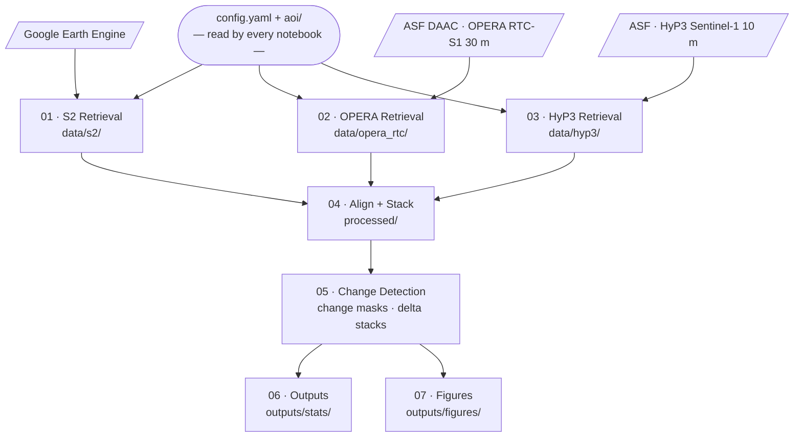

# Pipeline workflow

All site-specific parameters flow from `config.yaml` and `aoi/` into every notebook.
The three data-acquisition notebooks (01–03) can run in any order; 04–07 must run in sequence.

